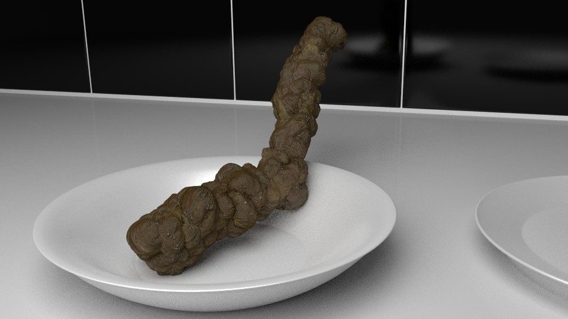

## Computer graphics is now a commodity of expression:

It's strange that people enjoy watching video, laughing at joke gifs, and talking in front of computer.

The device was originally invented as calculator, not for versatile entertainment machine. But it's a triumph for computer. With the devices, we can express almost everything.

There are many "universal expression means", if I call it, for example, drawing, novel, comic, movie, and talking. Such tools can give people what's in your mind. You can find what people do with them.

Some people use it as a serious purpose for example art, describing social issue, or how life is beautiful. Other people use it just for entertainment, joking, even porno.

You would disdain how people use techniques to do stupid things. But that's why they are universal expression means.

Turning to computer graphics, Blender is a free, open source software for CG. Like other expression means, Blender can make almost everything, for free. Everyone can embark on this.  

## Personal is sometimes better than professional:

However, unfortunately Blender communities seem not to be enjoy such a great situation.

Even with entirely free software, many Blender guys are highly affected by entertainment industries and art. They are obsessed with how to close to professional movie, animation, art looking. Professional is not always nice.

Since CG has long been high-technology art with huge budget, industries has been forced to earn money to at least avoid deficit. So they make products for mass market which has limited interests. It means that expression by CG has long been bend by industry-side.   

Again, I want to say that computer graphics can make almost everything for free. You can make completely personal project in your mind.

For instance, About your troublesome neighbor, how your gone grandma sit in armchair everyday in your house, which your part is itching now, your last night's dream, ISIS issue, scientific thought, fraudulent trick by crooks, why democracy is always failed, vulgar jokes.

I posted realistic shit. But I can make series "See my health every day" in CGI.

Aside from shit, I think almost similar topics are existing in other means of expression. If people making the topics in CG, computer graphics is then a true commodity tool.  

## Like Mozart:

Mozart is famous or infamous for a vulgar joke lover. Even he composed music confining jokes, eg. "Leck mich im Arsch", "Ein Musikalischer Spaß".

It's weird. Why should he make them especially in form of music? I think he is not just an music artist, music is a way he can express his mind. He talks a story through music and jokes around through music, that's it. He is really enjoying music.

So, if I make shit by CG, You should feel that it is a proof how CG is great. And I want to see your CGI showing what is really in your mind.