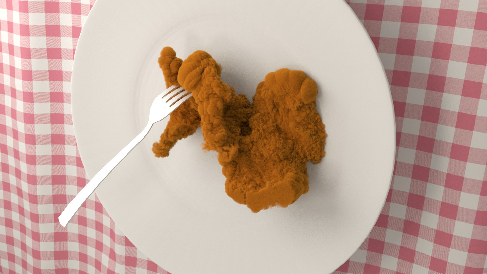

## Advantages of remaking personal illusion in CGI:

### Realistic visual illusion:

Illusion is false interpretation of sensory stimulation that occurs in our brain. In this psychological state, we receive imaginary things as reality, at least at first glance.

Photo-realistic CGI of illusion is a good way to remake such experiences.

### Easy to make:

3D object is reusable. You don't have to make realistic object from scratch. Many object has already been shared on websites, such as [Blendswap](http://www.blendswap.com/blends).

It is often easier than drawing especially for those who don't have much of drawing skill.

### Illusion as a creation:

Remaking personal illusion itself can be a creation. Since illusion is sometimes unpredictable combination of images even for creator, It could be a creative approach to make an artwork.

### Using for thinking:

Illusion can be used for thinking through unexpected combination of things.

For example, if you feel that a map of country looks like an animal, it means that you accidentally relates data of map with animal.

Another example, if you see a illusion, you can think "what if it is real?" or "how to make it real?". The questions are seeds for creative thinking.  

## Case Studies:

### Suzanne Monkey Popcorn:

  The idea of monkey popcorn came from my illusion when I was eating popcorn. I saw many monkeys in the bag of popcorn as I reached hand into it.

The popcorn above is a remake of the illusion, by merely adding displace modifier to suzanne monkey. [1]  

### U.S. Whale:

 When I see U.S. map, I always can't help but see a whale in U.S. like the image above. The reason is probably the shape of the country and division line of states. But if I say that U.S. resemble a whale, people would not be understood what I mean.

The image show what I see in U.S. map. It was very easy to make. The image is just a colored U.S. map with eye ball. [2]  

### Lorenz Attractor Owl:

 when I saw Lorenz attractor in a book, I felt being watched by something not a human. I found that it is like eyes of owl.

So I put the Lorenz attractor in the face of owl. The resulted image is what I saw in the book. [3]

### Fried Chicken from Smoke Simulation:

---
## Annotations:

### 1:

*   Original blog post: [Blender: I finally found Suzanne monkey is popcorn! - Gappy Facets](http://gappyfacets.com/2014/11/30/blender-finally-found-suzanne-monkey-popcorn/).
*   File download link: [Monkey Popcorn | Blend Swap](http://www.blendswap.com/blends/view/76655).

### 2:

*   Original blog post: [Blender: Every time I see a U.S. map, I meet the mammalian - Gappy Facets](http://gappyfacets.com/2015/04/22/blender-every-time-i-see-a-u-s-map-i-meet-the-mammalian/).
*   [U.S Whale | Blend Swap](http://www.blendswap.com/blends/view/80226).

### 3:

*   Original blog post: [Lorenz attractor is owl. - Gappy Facets](http://gappyfacets.com/2016/03/30/idea-lorenz-attractor-owl/)

