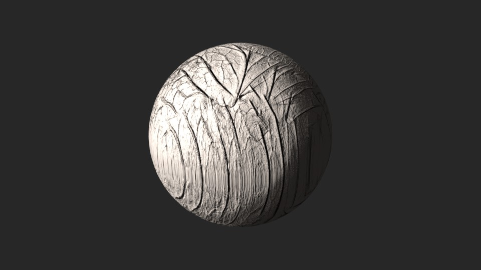
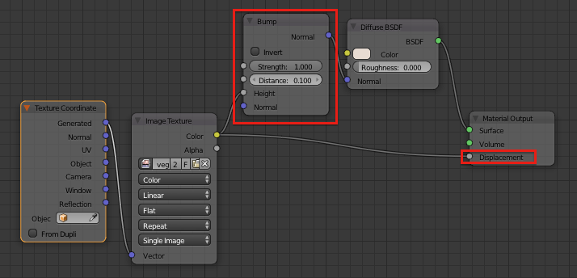
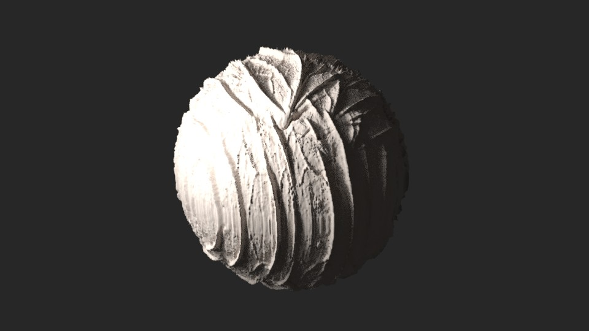
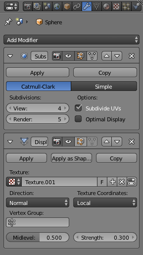
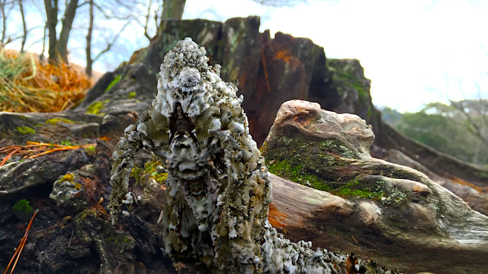
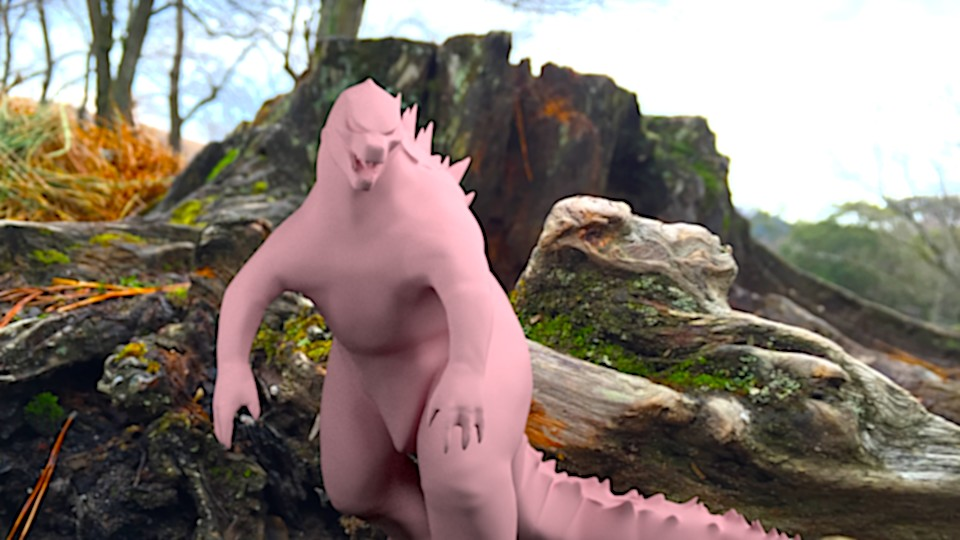
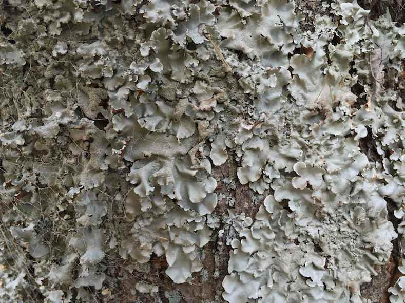
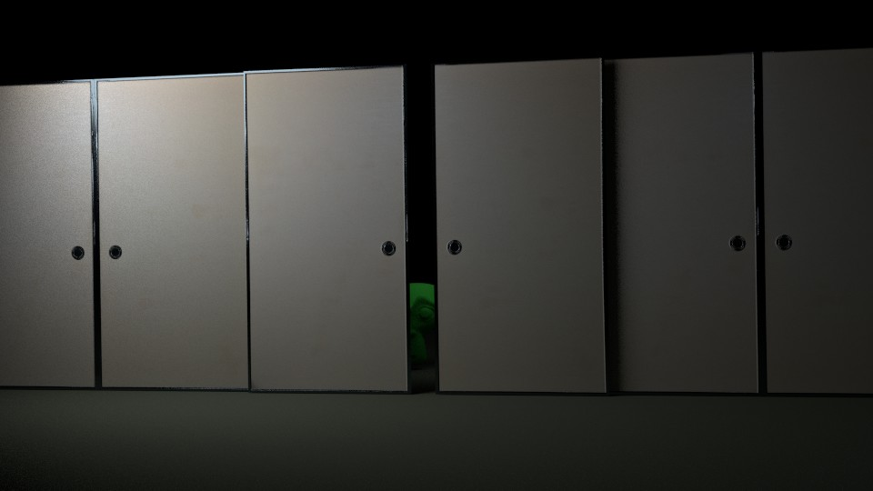
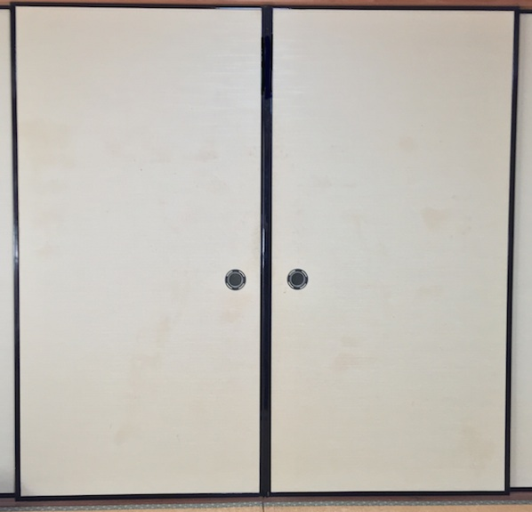
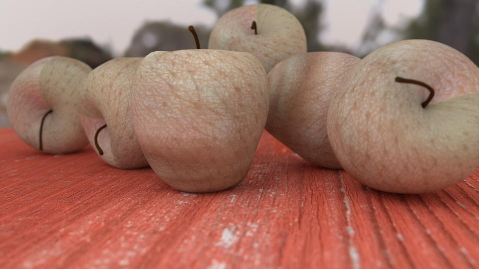

# Using Pictures Around You With Bump/Displacement

## Textures Exist Everywhere Around You:

Everything can be texture of 3D object when you take a picture and use it in CGI software. It means that resource of texture is everywhere around us -- wall, ground, sky, distant view, and even body parts.

This kind of project makes everyday life fun, and makes you a hunter for texture at any given time.

### Texture as Bump/Displacement map:

Texture is not only used for color, but for detailed rough or pattern on surface of object by bump or displacement.

Bump or displacement is a way to interpret a texture's color as mapping for extent of extrusion object's surface.

It is a key for realistic objects in 3D because it provides detailed surface on objects. Using the technique, pictures of everyday life can be used for surface modeling of different objects from original. 

It is a kind of alternative reality-maker.  

## How to Apply Bump/Displacement in Blender:

### Material Node of Bump/Displacement:

Bump and displacement in material node change normal of surface for fake of rugged mesh. The pattern and intensity are mapped along with color of texture image.

Put very simply, black part of texture is dented and white part of texture is extruded. 

It's very useful because it doesn't need additional division of mesh. The image above is a simple sphere but has detailed surface as shown.

The basic node for bump and displace is the screenshot above. Bump and displacement can be used separately.

### Displace Modifier:

Displace modifier is not fake. It extrudes mesh along with color of texture.

A disadvantage of the method is need for many division of mesh for detailed surface.

The modifier setting for the sphere is like above. The sphere is applied to subsurf modifier 5 times, then applied to displace modifier  

## Case Studies:

### Lichen:

This is Godzilla applied to displace modifier and displace material node with lichen texture that I took in the neighborhood.

The white part of lichen extrude as a whole in the picture, and bump and displace modifier also extrude white part of texture. The Godzilla is covered with replicated lichen on surface in 3D.[1]

### Fusuma Screen:

The Fusuma screen in 3D is a plane object with bump with the texture of fusuma screen. The well-separated black/white texture is easy to be bumped.

Usually black is dented and white is extruded. But in this case, the color mapping was inverted to extrude black frame of fusuma screen.[2]

### Skin:

It's not a replication of reality. The apple is covered by skin texture with bump.

It looks creepy, but the texture and bump succeed to make it looks soft, instead of solid.[3]

* * *

## Annotations:

### 1.

* This is fan-art.
* The original blog post: [CGI: Lichen Godzilla - Gappy Facets](http://gappyfacets.com/2015/01/01/cgi-lichen-godzilla/).
* The Godzilla is [Godzilla - 3d model - .obj, .dae](http://tf3dm.com/3d-model/godzilla-5370.html) by 3dregenerator.

### 2.

* The original blog post: [Blender CGI: Fusuma Screen - Gappy Facets](http://gappyfacets.com/2016/01/26/blender-cgi-fusuma-screen/).

### 3.

* The original blog post: [CGI: Skin-Apple from the Tree of Life - Gappy Facets](http://gappyfacets.com/2014/12/31/cgi-apples-tree-life/).

