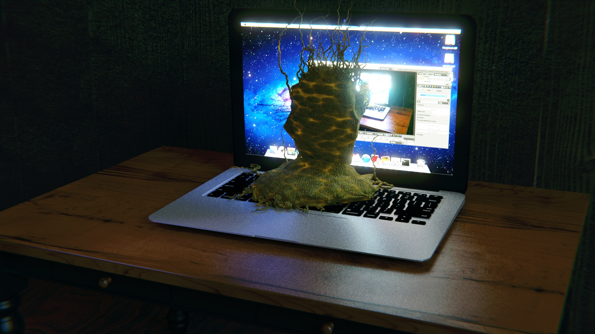

It is a sort of experimental CGI. Since it's hard to explain without example, see the case studies first.  

## Case Studies:

### A Blender User:

>"I made the CGI by Blender. The process was weary for me because I couldn’t use mouse of my Macbook Air, and the glare monitor in the dark room made fatigue in my eyes.
>
>Also I have pain in my neck because I kept lifting my upper body during work to see the monitor at close distance.
>
>The CGI makes me confident in my skill. Now I have decided to go out of serenity and reveal my existence to the world, and communicate with the world".

The picture and text is part of a blog post.[1] The CGI is a scene that a creature is making CGI image by Blender with Macbook Air in the dark room.

The text is seemingly a mere description of the CGI, but if you read it carefully, you notice that it is monologue of the creature itself when he is making the CGI.

Also, if you take a closer look at the monitor of creature's computer, the window of Blender shows the same scene that the creature is making CGI in the dark room. It implies that the self-referential structure continues endlessly into inward of computer  and even outward of the CGI image.

As a result, the blog post implies that the author of blog is the creature and he made a remake image of actual scene that he is making the CGI.

This is a mockumentary post with metafiction narrative.  

## Metafiction in CGI:

In novels, metafictional narrative allows characters to mention external situation of novel --for example, referring to real-life event or acknowledging the novel as fiction, or talking directly to readers.

Likewise, metafiction of CGI reflect external situation of the CGI.

A scene of viewing or making CGI image is good setting for metafiction because it reflects the actual situation in reality where the CGI image exists.

For example: A CGI image that a person is making CGI using PC, and the PC shows the same CGI image that the person is making CGI using the PC.  

## mockumentary with CGI：

Photo-realistic CGI can be a fake picture. It is good buddy for mockumentary. But Mockumentary of CGI is more direct way.

As the case study shows above, it is fake documentary narrative on the CGI. In the expression, the CGI is not side-dish for mocking but it is main-dish for the expression.

* * *

## Annotations:

### 1.

*   The original blog post: [Blender CGI: A Blender User - Gappy Facets](http://gappyfacets.com/2016/02/05/blender-a-blender-user/).
*   The Macbook Air object is [MacBook Air | Blend Swap](http://www.blendswap.com/blends/view/53154) under CC-BY-SA license by riccardo_pavone.